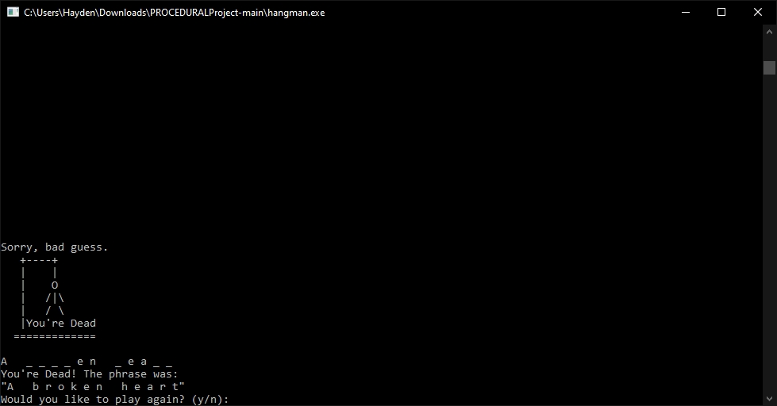
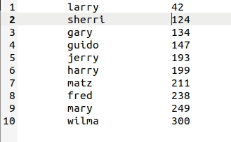
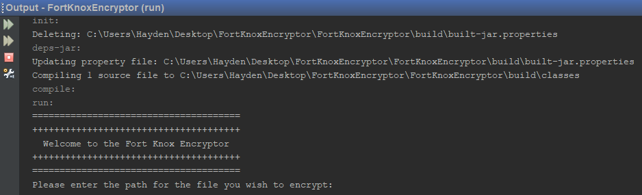
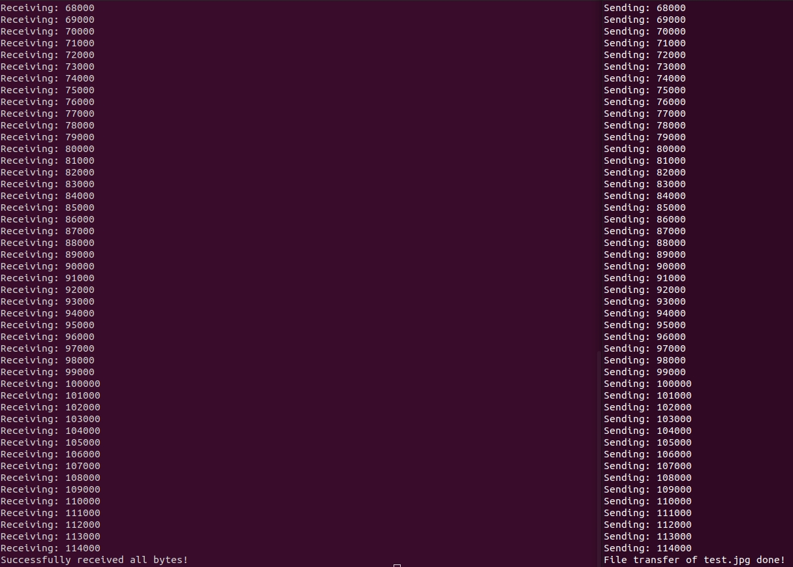
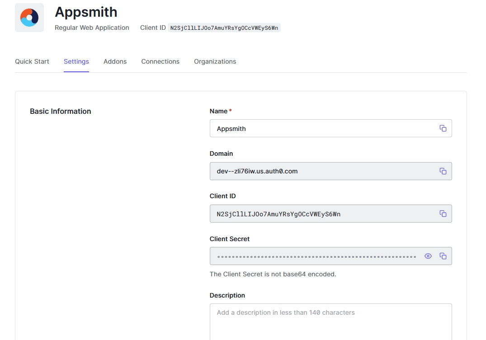

Portfolio
=========

Programming Projects
--------------------

*For access to my private project repositories, please [email me](mailto:HMAckerman@csustudent.net?subject=GitHub%20Access) with the subject line, GitHub Access.

---
### [Hangman with Structs | CSCI 235](project1)

---
### [Perl Hash Table with File Input and Output | CSCI 301](project2)

---
### [Fort Knox Encryptor | CSCI 325](project3)

---
### [UDP Client and Server | CSCI 332](project4)

---
### [Appsmith Web Application | CSCI 495](project5)

 

Ethics Papers
-------------

### [The Good Hacker?](/pdf/csci235Ethics.pdf)

-   **Class: CSCI 235**  
-   **Grade: 100.00**

### [Copyright - A Necessary Evil](/pdf/csci301Ethics.pdf)

-   **Class: CSCI 301** 
-   **Grade: 100.00**

### [Ethics in Cybersecurity](/pdf/csci325Ethics.pdf)

-   **Class: CSCI 325** 
-   **Grade: 100.00**

---

Presentations
-------------

### [The Equifax Data Breach](/pdf/EquifaxDataBreach.pdf)

- **Class: CSCI 301** 
- **Grade: 100.00**

### [How to Compromise A Cell Phone](/pdf/HowtoCompromiseaCellPhone.pdf)

- **Class: CSCI 405** 
- **Grade: 100.00**

---

Infographics
------------

### [Laws and Standards](/pdf/The Laws of Cybersecurity-HaydenAckerman.pdf)

- **Class: CSCI 352**
- **Grade: TBD**

---

Page template forked from <a href="https://github.com/csu-cs/csci-portfolio">CSU-CS</a>

<!-- Remove above link if you don't want to attributive -->
