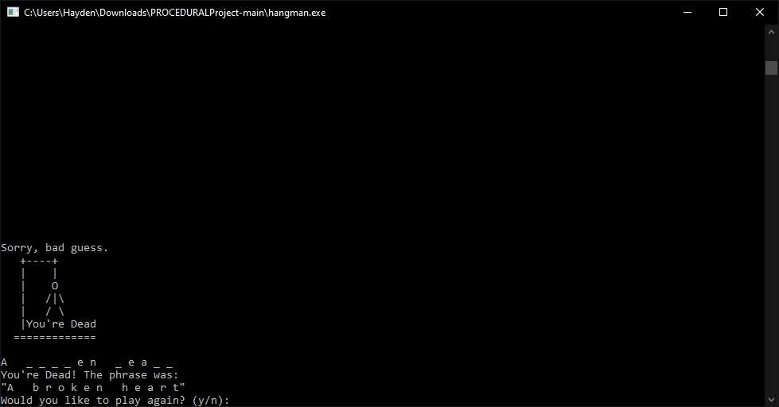

[Back to Portfolio](./)

Hangman with Structs
===============

-   **Class: CSCI 235** 
-   **Grade: 100.00**
-   **Language(s):**
-   **Source Code Repository:** [HMAckerman/PROCEDURALProject](https://github.com/HMAckerman/PROCEDURALProject)  
    (Please [email me](mailto:HMAckerman@csustudent.net?subject=GitHub%20Access) to request access.)

## Project description

This project is a team project. This project was an accumulation of all C++ knowledge learned within CSCI 235, Procedural Programming. The task was to create a Hangman-style game with predefined phrases in a text file. This program randomized the phrase chosen from the text file, allowing the player to play multiple times until all phrases were exhausted. Additionally, this program offered several different difficulty settings so the user can play harder "levels".  

## How to compiles / run the program

How to compile (if applicable) and run the project.

```bash
cd /project1
g++ -Wextra -std=c++17 -o hangman.exe hangman.cpp
Double-click on hangman.exe to run the program.
Enter a difficulty level.
```

## UI Design

This project was primarily UI based through a command prompt. First, the user runs the hangman.exe file. A command prompt pops up, asking the user for their preferred difficulty level (see figure 1). The user is presented with a "noose" and several underscores. They are prompted to make a guess (see figure 2). If the user enters a letter that it is in the phrase, they receive "Good guess!", and the game continues (see figure 3). However, if they make an incorrect guess, a part of the stick figure is added to the noose. The game also keeps track of incorrect guesses (see figure 4). If the user wins, they receive a message saying "You win!". The game then prompts them for a replay (see figure 5). However, if they take too many guesses, they are "dead" (see figure 6). 

<br>
Fig 1. The user is given the choice to choose a difficulty.

<br>
Fig 2. The user is prompted to make a guess.

<br>
Fig 3. The user makes a correct guess.

<br>
Fig 4. The user makes an incorrect guess.

<br>
Fig 5. The user wins a game!

<br>
Fig 6. The user makes too many incorrect guesses.

## 3. Additional Considerations

Although this program seems simple at first glance, most of the backend is rather complex. It required making sure that every time the game was replayed, a different phase was used. Additionally, it required analyzing phrases on a per-character basis in the file. This was my introduction to C++, and it was a great learning experience.

## 4. Additional Credit

This project was a team effort. I could not have done it without the help of Ryan Hinson. 

For more details see [GitHub Flavored Markdown](https://guides.github.com/features/mastering-markdown/).

[Back to Portfolio](./)
