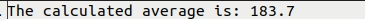
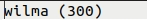

[Back to Portfolio](./)

Perl Hash Table with File Input and Output
===============

-   **Class: CSCI 301** 
-   **Grade: 100.00**
-   **Language(s): Perl**
-   **Source Code Repository:** [HMAckerman/SOSProject](https://github.com/HMAckerman/SOSProject)  
    (Please [email me](mailto:HMAckerman@csustudent.net?subject=GitHub%20Access) to request access.)

## Project description

This project is a small script used to read scores from a text file and then does several operations, including averaging, sorting, and finding the largest value. This program implements a hash table to store values based on a key, the name of the individual, and associates the name with a score, in this case a bowling score. First, the program reads from a text file known as “scores.txt”. This file is formatted in a “name score\n” format with the name and its associated score separated by a space. Secondly, the program takes all the names in the “scores.txt” file and averages the scores into one output file known as “average.txt”. Thirdly, the program takes all of the scores and sorts them in ascending order by score and outputs them into a “sorted.txt” file. Finally, the program takes the largest score and outputs the individual’s name and associated score to a “winner.txt” file.

## How to compiles / run the program

How to compile (if applicable) and run the project.

```bash
cd /project2
perl -MCPAN -e shell
install File::Slurp
install List::UtilsBy
q
./perlHashing.pl
```

## UI Design

This program has no UI, due to it being a scripting exercise with an emphasis on the structure of Perl hash tables. While not overly complex in function,
the program fulfills a useful role of reading information from a text file, manipulating it, and creating output files. In figure 1, the first operation of sorting can be viewed, where the scores are sorted in ascending order. The names and scores are associated with one another thanks to a hash table. The averaging function is displayed in figure 2. This is the output after averaging all the scores together. The third operation selects the name with the highest score. 


Fig 1. The output after sorting the values in ascending order according to their score. 


Fig 2. The output after averaging the scores together.


Fig 3. The output after deciding the winner. 

## 3. Additional Considerations

This was a simple yet important exercise in Perl. The hash table and file input/output showcased the unique relationships between variables. 

For more details see [GitHub Flavored Markdown](https://guides.github.com/features/mastering-markdown/).

[Back to Portfolio](./)
