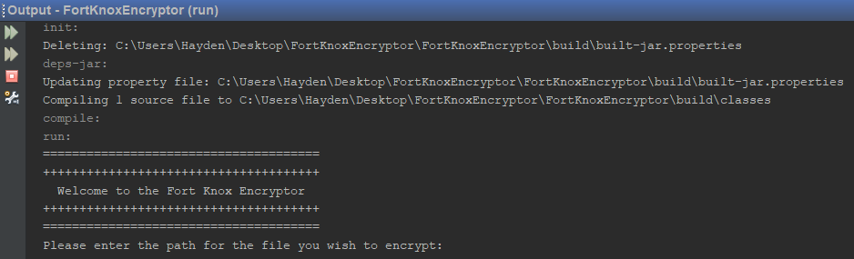
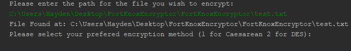
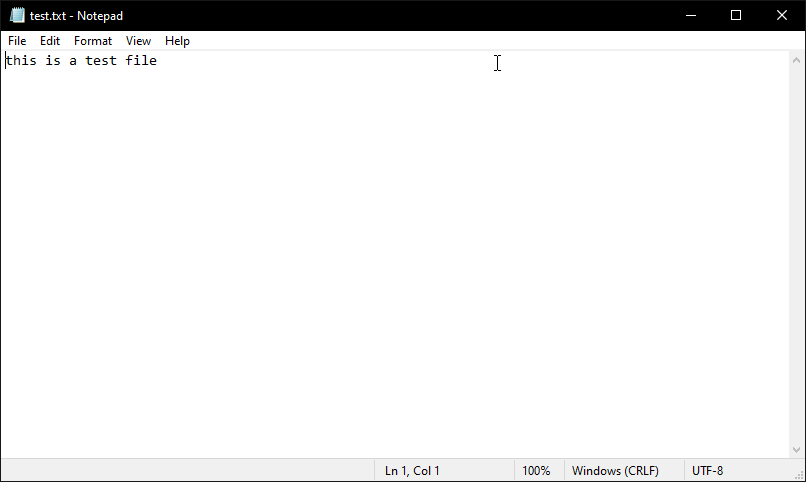
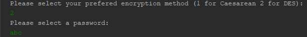
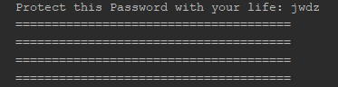
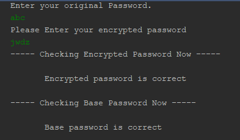
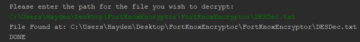
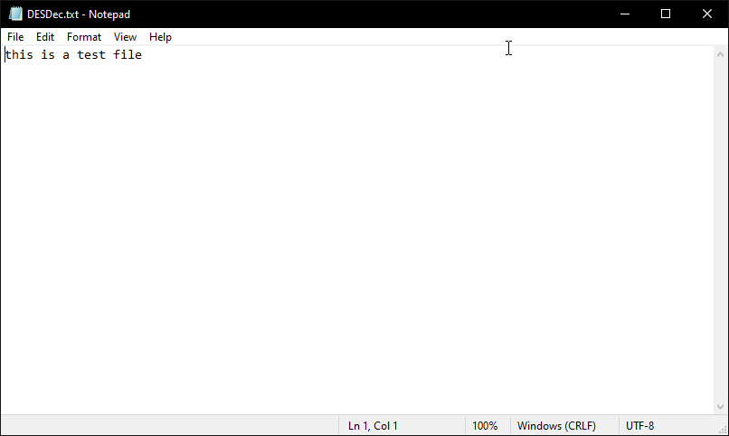

[Back to Portfolio](./)

Fort Knox Encryptor
===============

-   **Class: CSCI 325** 
-   **Grade: 95.00**
-   **Language(s): Java**
-   **Source Code Repository:** [HMAckerman/OOPProject](https://github.com/HMAckerman/OOPProject)  
    (Please [email me](mailto:HMAckerman@csustudent.net?subject=GitHub%20Access) to request access.)

## Project description

This project is a file encryption service that will take a user designated file and a user designated encryption algorithm, pulled from a list of provided encryptions from the UI. The user will start by running the program, which will then ask the user to provide a file. After it verifies that the file exists, the UI will present a list of several encryption algorithms that the user can use on the file. Then, the program will process the form of encryption and print out a completion statement once finished. The program will show the user where the file was saved to. A prompt will appear, asking if the user wishes to decrypt the file or quit the program. Once it is decrypted, the file's location will be displayed (in the same place as the encrypted file) and the program will exit.

## How to compiles / run the program

How to compile (if applicable) and run the project.

Step 1: Install the Netbeans IDE, version 8.1 or later. 
Step 2: Clone all files from the Github repository into a folder. 
Step 3: Launch the Netbeans IDE and select "Open Project". 
Step 4: Navigate to the project folder. 
Step 5: Open the project. 
Step 6: Highlight the "EncryptMain.java" file. 
Step 7: Click "Run Project". 

## UI Design

The program is not very UI interactive in itself, but the Netbeans IDE is an interaction-based UI as a whole. However, the focus is not on the Netbeans IDE, but the program itself. Once the user starts the "EncryptMain.java", the user is prompted to enter the path to a file they wish to encrypt (see figure 1). If the file is not found, the program will throw an error. However, if a file is found, the program gives the green light and proceeds to ask the user what encryption algorithm they would prefer (see figure 2). For reference, see figure 3 for what the test file contains. Once the user presses a number for the preferred encryption algorithm (1 for Caesarean and 2 for DES), the program then asks for a password to encrypt the file with (see figure 4). Once the user enters the desired password, it is hashed and salted (see figure 5). The user has successfully encrypted a file. See figure 6 to inspect the encrypted contents of the text file. Next, the user is prompted for the original password and the encrypted password. The program will verify both the original and the encrypted password (see figure 7). The user is prompted for the file path of the file they want decrypted. If it is found, the program will decrypt it (see figure 8). See figure 9 to verify that the file is decrypted.

 
Fig 1. The user inputs a file path.

 
Fig 2. The user chooses the encryption algorithm.

 
Fig 3. This is what the test file contains.

 
Fig 4. The program gets the desired password from the user.

 
Fig 5. The password is hashed and salted.

 
Fig 6. This is the encrypted contents of the file.

 
Fig 7. The program verifies both the original and encrypted password.

 
Fig 8. The program decrypts the file.

 
Fig 9. This is the decrypted contents of the file.

## 3. Additional Considerations and Credit

This project was not based upon a single student's work. Rather, it was the work of several students including myself. Those students are Trevor Abel, Ryan Hinson, and Alex Lopez. This project could not have come to fruition without their help. All code and work has been credited to the proper authors. 

For more details see [GitHub Flavored Markdown](https://guides.github.com/features/mastering-markdown/).

[Back to Portfolio](./)
