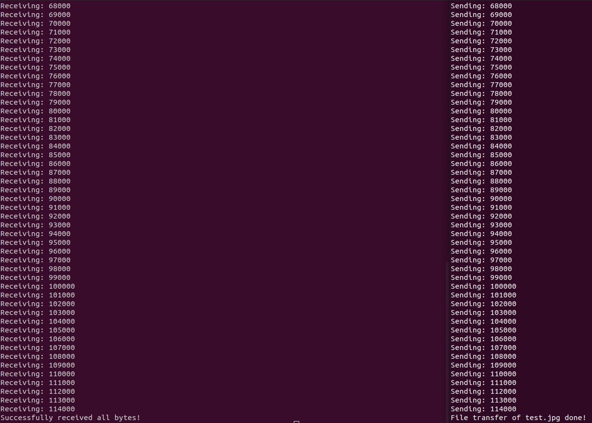

[Back to Portfolio](./)

UDP Client and Server
===============

-   **Class: CSCI 332** 
-   **Grade: 100**
-   **Language(s): C++, C**
-   **Source Code Repository:** [HMAckerman/APPNTWRKProject](https://github.com/HMAckerman/APPNTWRKProject)  
    (Please [email me](mailto:HMAckerman@csustudent.net?subject=GitHub%20Access) to request access.)

## Project description

This project is a team project. This project is a mix of two programs, one being the client that sends UDP packets and the other being the server that receives the UDP packets. This program implements the C++ networking library, utilizing system-based sockets and ports, along with the capability to send files . First, the user compiles and runs the UDPClient.cpp, and then the user opens a new terminal and runs UDPServer.cpp. In doing so, this sets up the two programs to receive input from the user. Then, the client asks the user for the IP address of the server, the port it is listening on, and the name of the file to transfer. The server is currently in a waiting state, and asks the user for the port it should listen on. Once the client and the server exchange a full conversation of data, the server will say "Successfully received all bytes!", and will stay in a waiting state if the user wishes to send more data. 

## How to compiles / run the program

How to compile (if applicable) and run the project.

```bash
cd /project4
g++ UDPClient.cpp -o UDPClient.out
g++ UDPServer.cpp -o UDPServer.out
Open two terminal windows.
Terminal 1: Do ./UDPServer.out
Terminal 2: Do ./UDPClient.out
```

## UI Design

This project was not UI-focused. Rather, emphasis was put upon the command line and reading user input from the command line. First, the user opens a terminal and runs the UDPServer. The user will input the port the server is going to listen on (see figure 1). Next, the user is going to open a second terminal window, and run the UDPClient. It will ask for the server IP address and the server listening port. Since these programs are locally hosted, the server IP is 127.0.0.1 (see figure 2). It will then ask the user for a file to transfer. To visually show that no data was lost in transmission, a picture is used (see figure 3). The server and client will print out how many bytes are being sent. Once file transfer is done, both programs will quit (see figure 4). See figure 5 for evidence that the picture transfered successfully. If any bytes failed to transfer, that part of the picture would be missing. 


Fig 1. The server is launched and the port is defined.


Fig 2. The client is connected to the server.


Fig 3. The photo used to test transmission capabilities.


Fig 4. The bytes are transferred.


Fig 5. The photo used to test transmission capabilities is shown to be successfully transferred.

## 3. Additional Considerations

This was an exercise in which the C++ networking library was utilized. Admittedly, I had never used the networking library before, so this was a great learning experience.

## 4. Additional Credit

This project would not be possible without the teamwork between Jason Woodbury and myself. Jason and I had to face less-than-ideal conditions, considering this project was completed during the beginning of the coronavirus. However, Jason and I were able to communicate sucessfully, and this project is the result of our efforts.  

For more details see [GitHub Flavored Markdown](https://guides.github.com/features/mastering-markdown/).

[Back to Portfolio](./)
