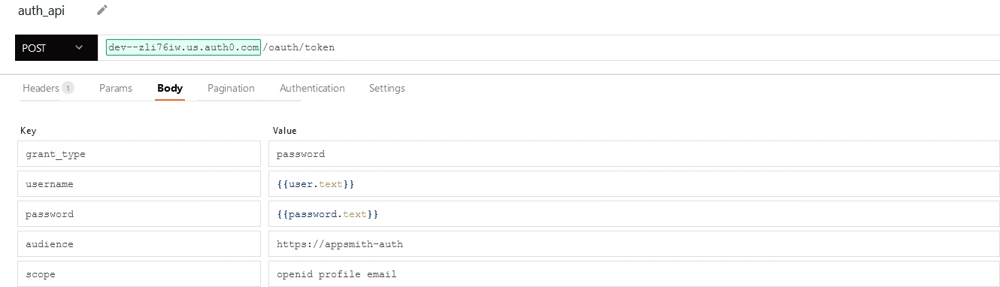
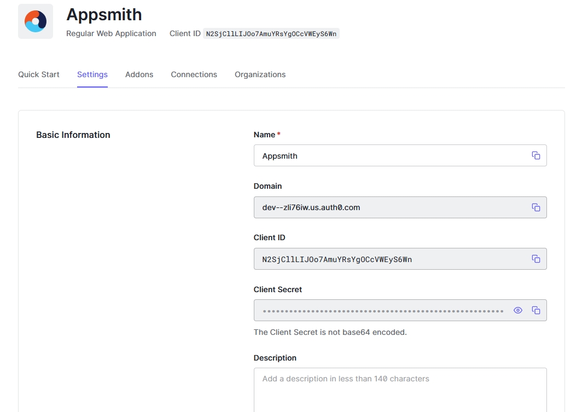

[Back to Portfolio](./)

Appsmith Web Application Backend
===============

-   **Class: CSCI 495** 
-   **Grade: TBA**
-   **Language(s): JavaScript**
-   **Source Code Repository:** N/A 
    (Please [email me](mailto:HMAckerman@csustudent.net?subject=GitHub%20Access) to request access.)

## Project description

This project was a team-based project, where my team and I were tasked with building a website for a small medical university. I will be showcasing the work that I have done in this project, being the backend developer. As a result, instructions will not be given to run/compile this project. This is not from me not wanting to give instructions, but from the inability to do so. 

## UI Design

This project operated around the "low-code" design, which is essentially a way to build a web application with very little code. However, this does not mean that the finished product will lack the functionality of a typical web application. Appsmith provides a way to link multiple datasources and create multiple APIs to interact with JavaScript snippets. The following screenshots will showcase the various tasks I accomplished. 

Fig 1. This is the authentication API I configured to handle login purposes.

Fig 2. This is the API that passes the username and password through the authentication API.

Fig 3. This is a JavaScript snippet that executes the auth_api on a button click.

Fig 4. This is the API that handles file upload to an Amazon S3 bucket. 

Fig 5. The database connection within the Auth0 service handles authentication, encrypting created passwords with the bcrypt algorithm.

Fig 6. A list of the users registered in the database.

Fig 7. A Student role in the RBAC security policy.

Fig 8. The Admin role in the RBAC security policy.

Fig 9. The Appsmith application endpoint.

Fig 10. The MongoDB collection with the users and the bcrypt-hashed passwords. 

## 3. Additional Considerations

Even though I primarily worked on the backend, this is still a team project. However, this project was not fully finished due to time constraints and scheduling conflicts. The team members I worked with were Edward "Matt" Phillips, Adam Thiemann, Blake Collins, Brian Diaz, and Lucas Neidlinger.  

For more details see [GitHub Flavored Markdown](https://guides.github.com/features/mastering-markdown/).

[Back to Portfolio](./)
