[Back to Portfolio](./)

pfSense w/ Snort IDS Setup and Log4j Exploit and Monitoring
===========================================================

-   **Class: CSCI 352** 
-   **Grade: 102.00**
-   **Project Document: [pfSense Setup Doc](/pdf/pfSense.pdf)**

## Project description
This project was a team-based project, where my team and I were tasked with putting together a hands-on exercise for the rest of the class to complete. This 
project utilized the pfSense firewall package and the Snort IDS/IPS software extension. The students were tasked with installation and setup of the pfSense 
machine, and assigning a static IP address to the WAN and LAN adapters. The students were also tasked with setting up the Snort software suite, downloading
threat signatures and verifying the MD5 hash of the signatures. Then, the students were told to run a ping command in the CLI against a site, and were told to 
record their findings from the Snort package. As extra credit, I provided students with the opportunity to run the Log4j exploit against a dockerized vulnerable 
web app, and detect the exploit through Snort.

## UI Design

This project's UI revolved around the VirtualBox virtualization software and running the disk images for pfSense and a Linux distro disk image. They were 
required to be on the same subnet, so the Linux box could access the pfSense setup wizard. The following screenshots will showcase aspects of the project.

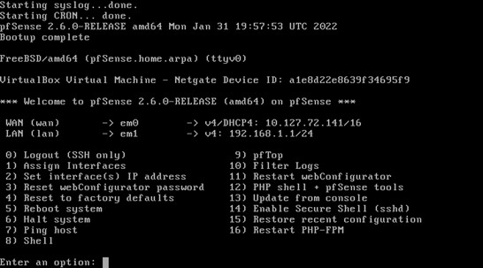 
Fig 1. This is the main interface of the pfSense box.

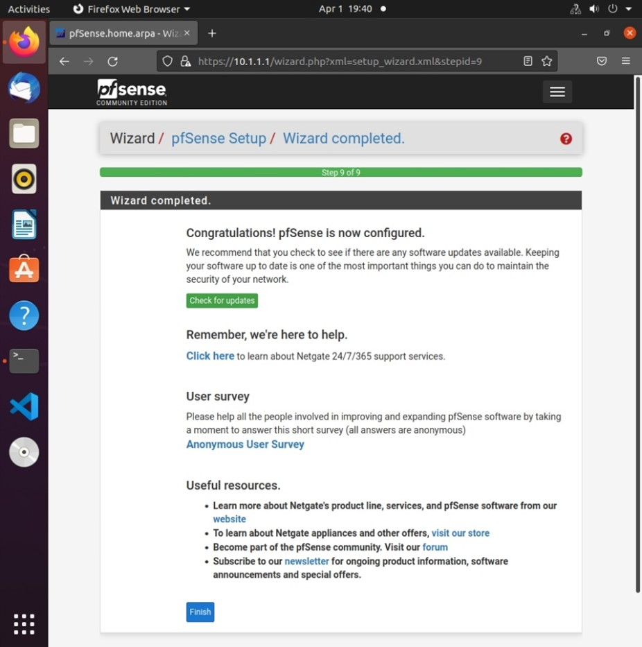 
Fig 2. This is the main setup wizard served through an internally hosted webserver in the pfSense package.

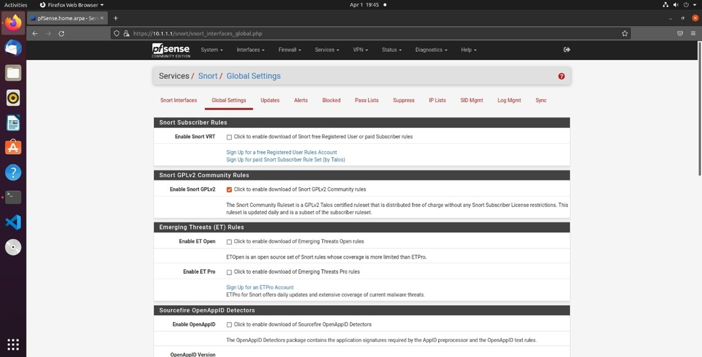 
Fig 3. This is the installation of the Snort IDS/IPS suite.

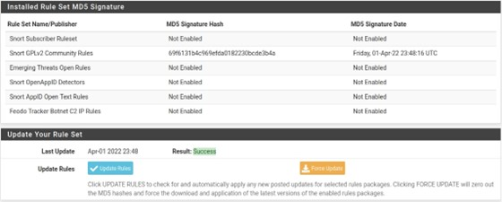 
Fig 4. This is the downloading of the threat signatures.

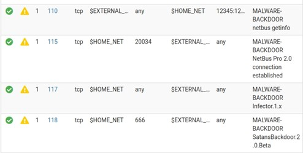 
Fig 5. This is the enabling of the threat signatures.

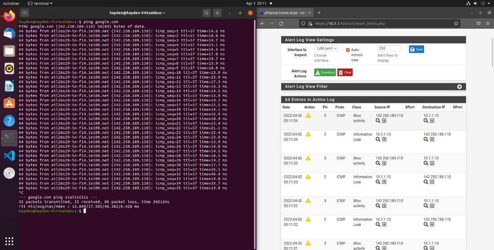 
Fig 6. The user pings a site, and the Snort suite alerts to the pings. 

Log4j Exploit
=============

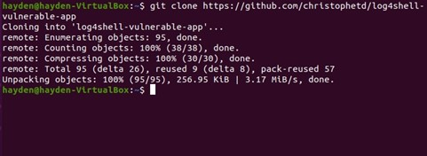 
Fig 7. The user clones a git repo of a vulnerable docker app.

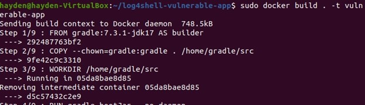 
Fig 8. The user builds the vulnerable app.

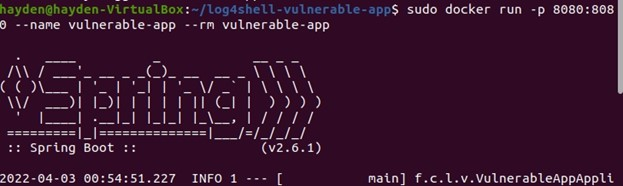 
Fig 9. The user runs the vulnerable app.

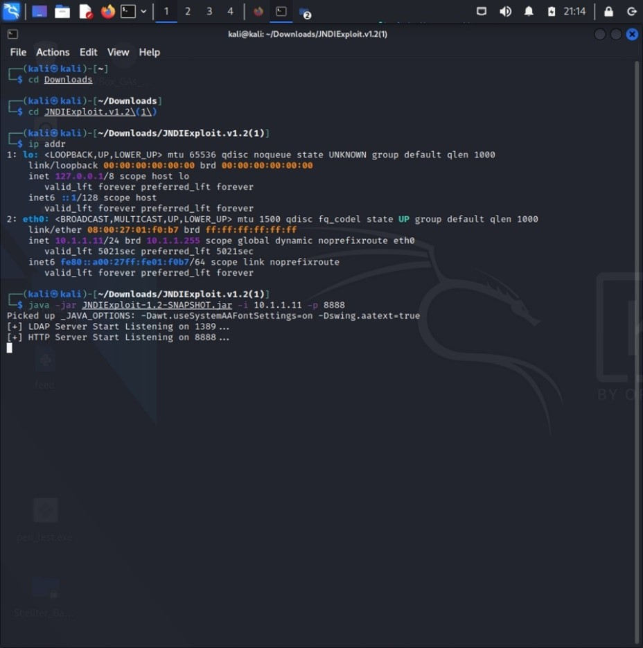 
Fig 10. On Kali Linux, the user sets up a malicious LDAP server.

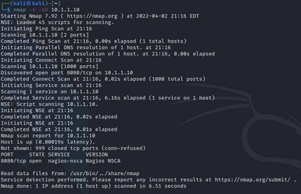 
Fig 11. The user does recon of the Ubuntu box hosting the vulnerable app.

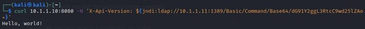 
Fig 12. The user exploits the Log4j vulnerability.

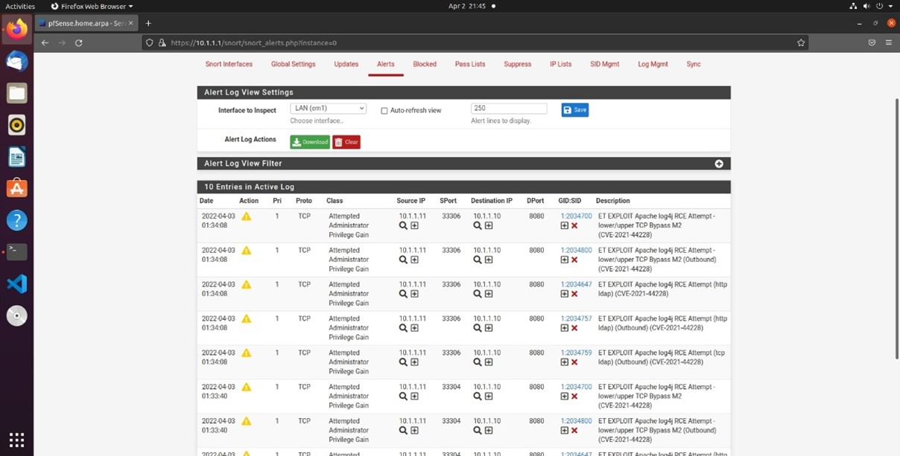 
Fig 13. Snort alerts to the exploit.

## Additional Considerations
I primarily worked on setting up the machines, but I could not have done this project without the help of Lexa Mosby and Brian Diaz. I could not have asked 
for better teammates. Due to their stellar work, our project was voted as the favorite among the students, hence why we received a 102. 
